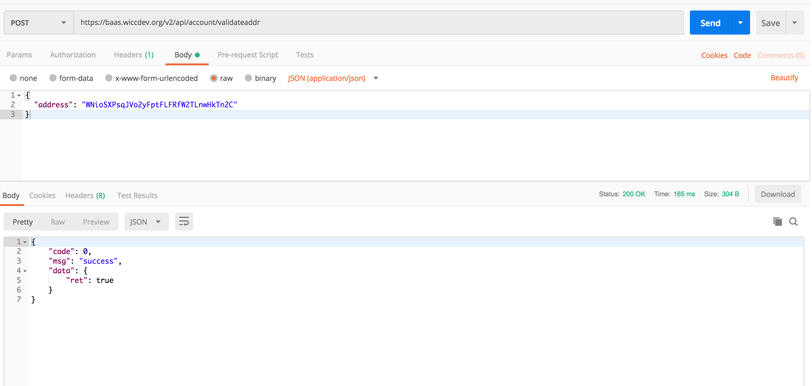

<extoc></extoc>
# BaaS(Blockchain as a Service）

## BaaS Introduction
BaaS provides an HTTP API interface for the WaykiChain network (mainnet/testnet).
Similar to `Infura` on the `Ethereum`, BaaS provides a wallet node server running in the cloud, so you don't have to deploy a node to access WaykiChain yourself. To develop a decentralized application (DAPP) or wallet application on WaykiChain.

## BaaS API

### v2(recommendation)

#### [WaykiChain Mainnet BaaS API v2 Swagger UI](https://baas.wiccdev.org/v2/api/swagger-ui.html)
**Base URL** `https://baas.wiccdev.org/v2/api`

#### [WaykiChain Testnet BaaS API v2 Swagger UI](https://baas-test.wiccdev.org/v2/api/swagger-ui.html)
**Base URL** `https://baas-test.wiccdev.org/v2/api`

### v1(old version)

#### [WaykiChain Mainnet BaaS API v1 Swagger UI](https://baas.wiccdev.org/v1/api/swagger-ui.html)
**Base URL** `https://baas.wiccdev.org/v1/api`

#### [WaykiChain Testnet BaaS API v1 Swagger UI](https://baas-test.wiccdev.org/v1/api/swagger-ui.html)
**Base URL** `https://baas-test.wiccdev.org/v1/api`

## BaaS API Call example
Take the v2 version to verify that the address is valid `validateaddr` as an example.

### Mainnet 

### Testnet 

