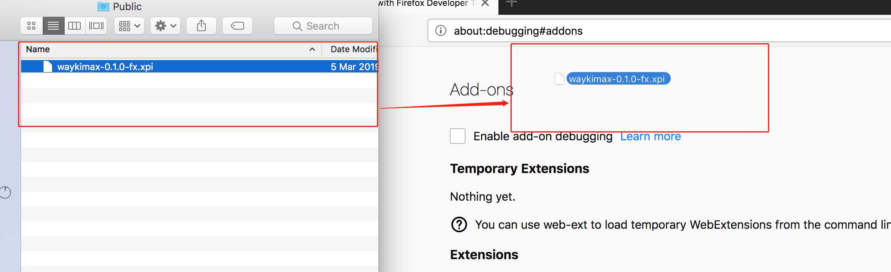

<extoc></extoc>
# WaykiMax

## Introduction

WaykiMax is a browser extension wallet for WaykiChain. 

It allows users to manage their account info, add `WRC20` token, check balance, create/import/export mnemonics, transfer WICC and `WRC20` token, etc.

More importantly, WaykiMax provides the [WiccWallet](#wiccwallet) interface to developers. Developers can integrate `WiccWallet` when developing DAPP so that they can sign and broadcast WaykiChain transactions. In turn enabling the use of DAPP from within the browser.

## installation method

### Chrome

#### Chrome：Method 1
[Click here](https://chrome.google.com/webstore/detail/waykimax/odaegfdpkolgbdaeibcebmibmibchbce) to install WaykiMax from Chrome web store

#### Chrome：Method 2

##### Download the WaykiMax zip file to the local and unzip it locally
[Download WaykiMax zip file](https://github.com/WaykiChain/wicc-webwallet-extensions/releases/download/v1.0.4/WaykiMax-v1.0.4.zip)

##### Download the Chrome browser and install the Wikichain Web Wallet plugin

##### Click on the developer mode and load unpacked

##### Installed the plugin successfully

### Firefox

#### Firefox：Method 1
[Click here](https://addons.mozilla.org/en-US/firefox/addon/waykichain/) to install WaykiMax from Firefox web store

#### Firefox：Method 2

##### Download WaykiMax xpi file to local
[Download WaykiMax xpi file](https://github.com/WaykiChain/wicc-webwallet-extensions/releases/download/v1.0.0/WaykiMax-1.0.0-fx.xpi)

##### Download the Firefox browser and drag the downloaded local file WaykiMax-x.x.x-fx.xpi into the browser

##### Click "Add" -> "Ok", you can add the plugin to the browser

#### Firefox：Method 3
**Note: This method can only temporarily add the plugin. If you close this browser, you will need to reinstall the plugin again.**

##### Download the WaykiMax zip file to the local and unzip it locally
[Download WaykiMax zip file](https://github.com/WaykiChain/wicc-webwallet-extensions/releases/download/v1.0.4/WaykiMax-v1.0.4.zip)

##### In the search box, type "about:debugging#addons" and click on "Temporarily Load Add-ons"

##### Click on the file you just downloaded,and choose"manifest-firefox.json".Click "Open",you can add the plugin to the browser

# WaykiBridge 

[WaykiBridge](application_api.md) is the DAPP development interface tool launched by the WiykiChain develop team. Developers can integrate the `WaykiBridge` interface when developing DAPP, that is, you only need a set of code（H5） to call the `WaykiMax` and [WaykiTimes APP](https://www.waykichain.com/WaykiTimes.html) wallet for signing and broadcasting WaykiChain transactions so that users can be in `Browser` and [WaykiTimes APP](https://www.waykichain.com/WaykiTimes.html) DAPP is used in the Application Center.
