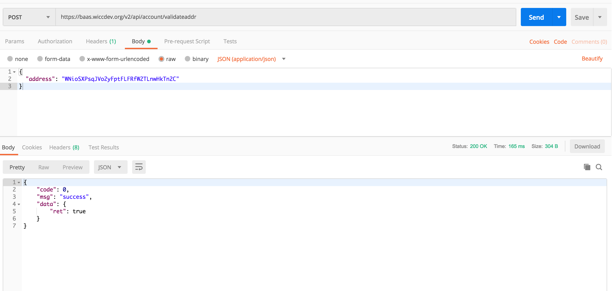
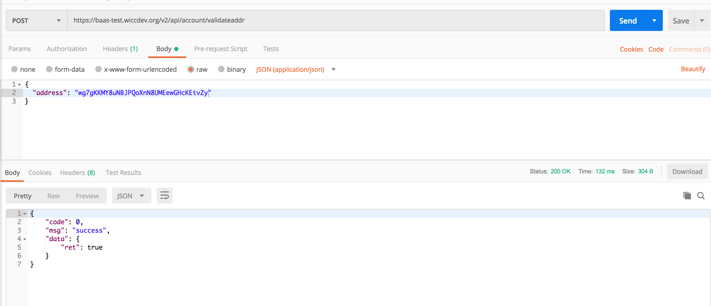

<extoc></extoc>
# BaaS(Blockchain as a Service）

## BaaS 简介
BaaS 为 WaykiChain网络（mainnet/testnet）提供 HTTP API接口。
与以太坊平台上的 `Infura` 类似，BaaS 提供在运行在远程服务器的钱包节点，因此您无需自己部署一个节点接入WaykiChain工作。 以便在WaykiChain 上开发去中心化应用（DAPP）或者 钱包应用。

## BaaS API

### v2(推荐使用)

#### [WaykiChain Mainnet BaaS API v2 Swagger UI](https://baas.wiccdev.org/v2/api/swagger-ui.html)
**Base URL** `https://baas.wiccdev.org/v2/api`

#### [WaykiChain Testnet BaaS API v2 Swagger UI](https://baas-test.wiccdev.org/v2/api/swagger-ui.html)
**Base URL** `https://baas-test.wiccdev.org/v2/api`

### v1(老版本)

#### [WaykiChain Mainnet BaaS API v1 Swagger UI](https://baas.wiccdev.org/v1/api/swagger-ui.html)
**Base URL** `https://baas.wiccdev.org/v1/api`

#### [WaykiChain Testnet BaaS API v1 Swagger UI](https://baas-test.wiccdev.org/v1/api/swagger-ui.html)
**Base URL** `https://baas-test.wiccdev.org/v1/api`

## BaaS API 调用示例
以v2版本中验证地址是否有效`validateaddr`为例

### Mainnet 

### Testnet 

