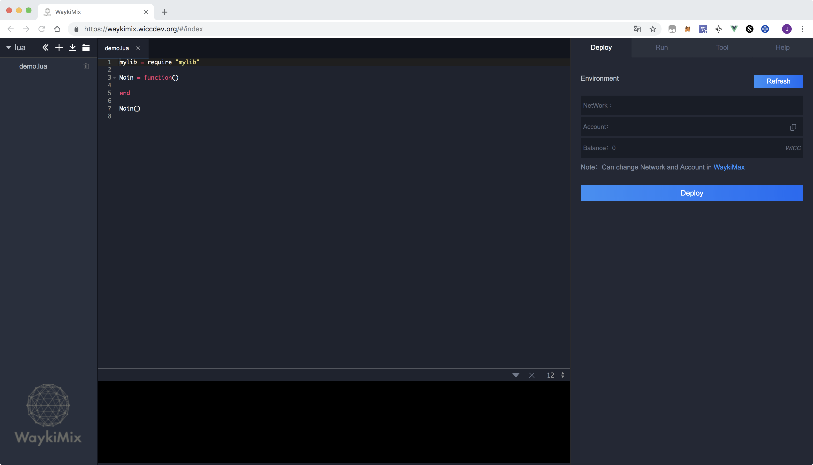
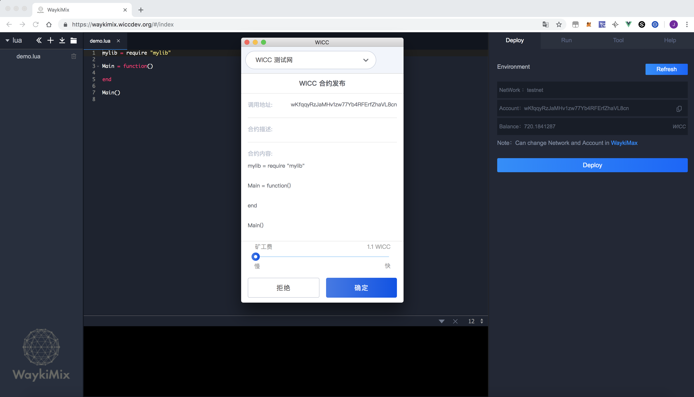
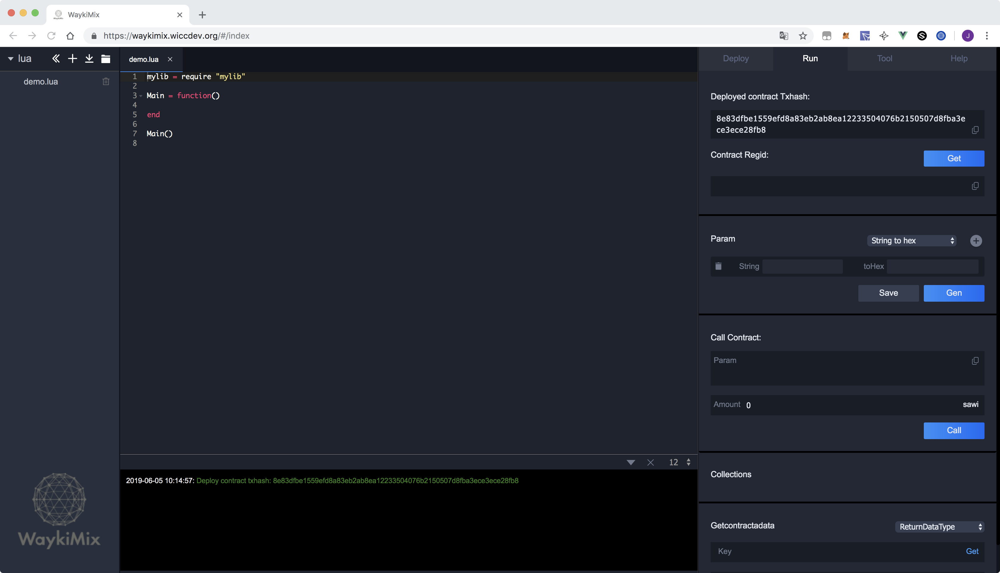
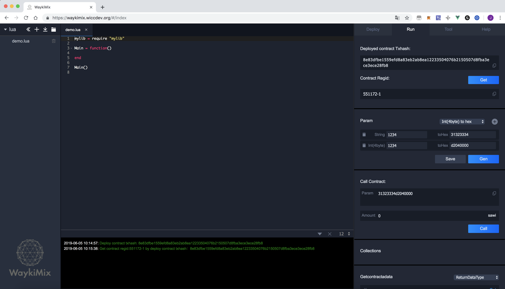
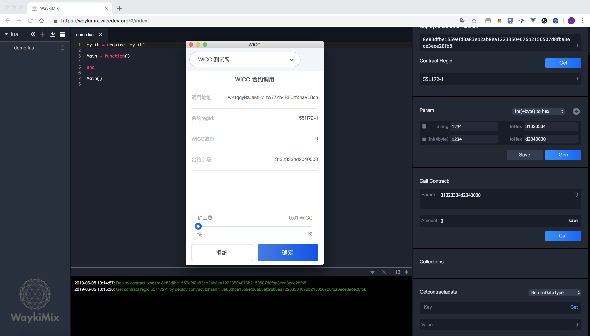
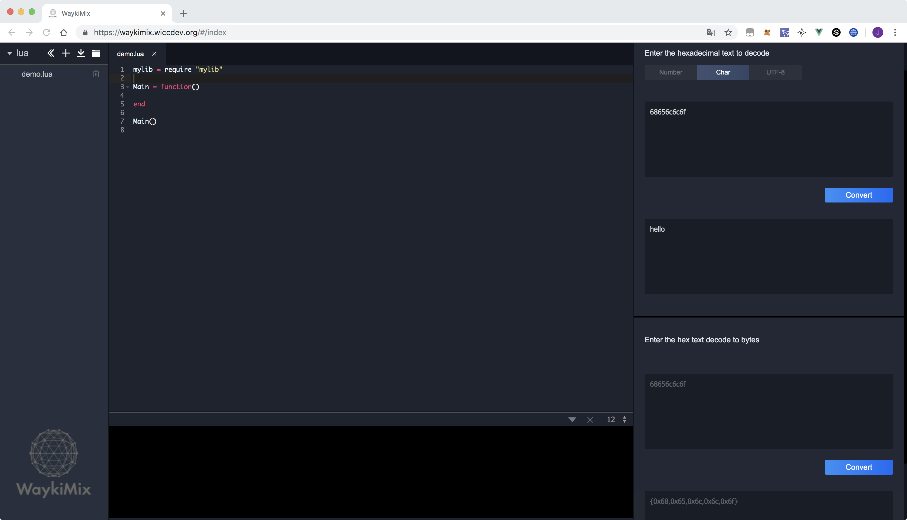
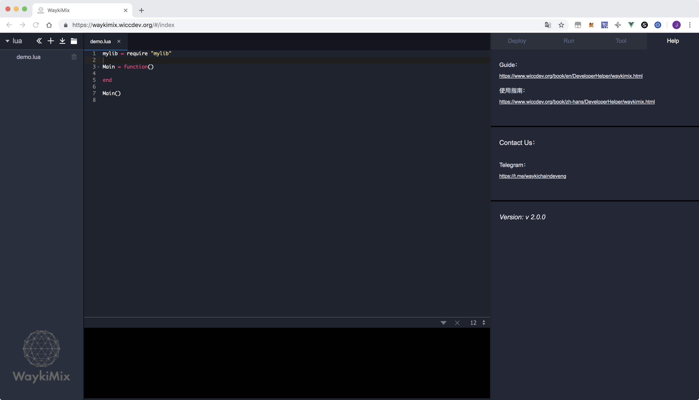

<extoc></extoc>
# WaykiMix

## 简介
`WaykiMix` 是一款基于vue.js语言开发的Web智能合约IDE，目前具备智能合约开发、部署、调用、调试等功能，可为开发者进行基于WaykiChain的Lua语言的智能合约开发提供极大的便利。

## 使用方法
### 安装插件钱包WaykiMax
[安装WaykiMax](./webextension.md)

### 打开智能合约IDE WaykiMix
点击链接[https://waykimix.wiccdev.org](https://waykimix.wiccdev.org)进入Web智能合约IDE

### 首页布局
WaykiMix操作界面左侧栏为文件管理，里面列出了当前工作区的文件，WaykiMix工具可支持从本地读取文件、保存文件到本地、新建文件等功能。

正中间的部分为工作区。工作区上半部分是代码编辑区，可进行基于Lua的智能合约编写，下半部分为Log输出区，方便开发者Debug。

右侧栏为功能区，提供了包括部署、调用、工具和帮助等功能版块。

### 功能区-Deploy
点击`Refresh` 按钮可刷新读取 `WaykiMax` 中钱包的网络、地址、余额等信息。

点击 `Deploy` 按钮可一键部署智能合约，此时调起`WaykiMax`进行签名，点击`确定` 即可。

### 功能区-Run
在通过`Deploy`部署智能合约之后，在`Run`板块中存在发布合约时的交易哈希

等待大约10s交易被确认后，点击`Get` 按钮即可获取到智能合约的regid

通过Param区根据具体合约内容拼接需要调用合约时传入的信息

点击`Gen` 按钮开始拼接需要调用合约时传入的信息

继续点击`Call` 按钮发起调用合约交易，此时调起`WaykiMax`进行签名，点击`确定` 即可，调用合约的交易 Log显示在Log区域。

### 功能区-Tool
Tool 板块提供`hexadecimal text to decode` 和  `hex text decode to bytes`功能，具体用法请参考示例

### 功能区-Help
Help 板块提供了操作指南链接、开发者联系方式、版本号等信息

## 开源代码

https://gitlab.com/waykichain-public/wicc-tools/wicc-waykimix
