<extoc></extoc>
# WaykiMax

## 简介
WaykiMax是WaykiChain的浏览器扩展插件钱包。允许用户管理其帐户信息，添加token，检查余额，创建/导入/导出助记词，WICC、token转账等。

同时WaykiMax为开发者提供了[WiccWallet](#wiccwallet) 接口。 开发者可以在开发DAPP时集成`WiccWallet`，以便他们可以签署和广播WaykiChain交易。从而可以在浏览器中使用DAPP。

## 安装方法

### Chrome

#### Chrome (谷歌)浏览器 ：方法一
[点击此处](https://chrome.google.com/webstore/detail/waykimax/odaegfdpkolgbdaeibcebmibmibchbce)从谷歌网上应用店下载、安装

#### Chrome (谷歌)浏览器 ：方法二

##### 下载 WaykiMax zip压缩包文件到本地并在本地解压缩
[下载 WaykiMax.zip](https://github.com/WaykiChain/wicc-webwallet-extensions/releases/download/v1.0.4/WaykiMax-v1.0.4.zip)

##### 下载Chrome浏览器，安装维基链Web钱包插件（中文对应：更多工具->拓展程序）
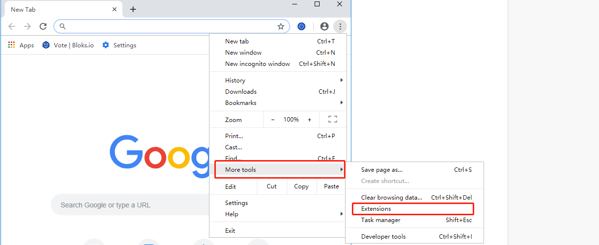

##### 点开开发者模式，并导入该文件（中文对应：加载已解压的拓展程序）
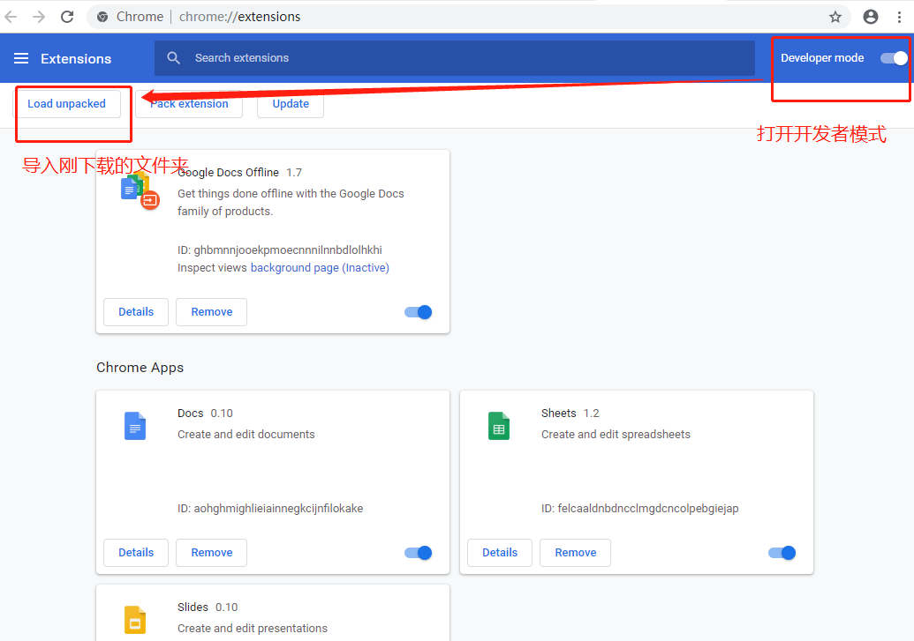
##### 导入后，安装该插件成功

### Firefox

#### Firefox（火狐）浏览器：方法一
[点击此处](https://addons.mozilla.org/en-US/firefox/addon/waykichain/)从火狐应用商店下载、安装

#### Firefox（火狐）浏览器：方法二

##### 下载 WaykiMax xpi 文件到本地
[下载 WaykiMax xpi文件](https://github.com/WaykiChain/wicc-webwallet-extensions/releases/download/v1.0.0/WaykiMax-1.0.0-fx.xpi)

##### 下载Firefox浏览器，直接将下载的本地文件"WaykiMax-x.x.x-fx.xpi"拖放到浏览器内
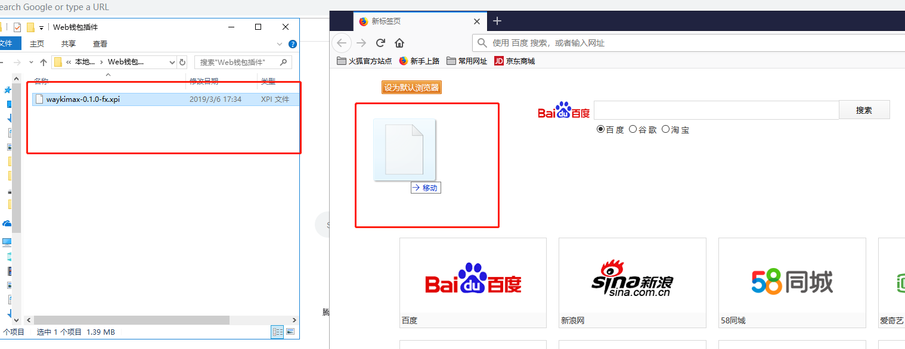

##### 点击”添加“—>"知道了"，即可添加该插件到浏览器
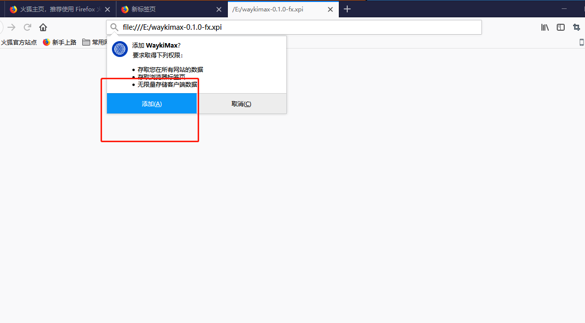
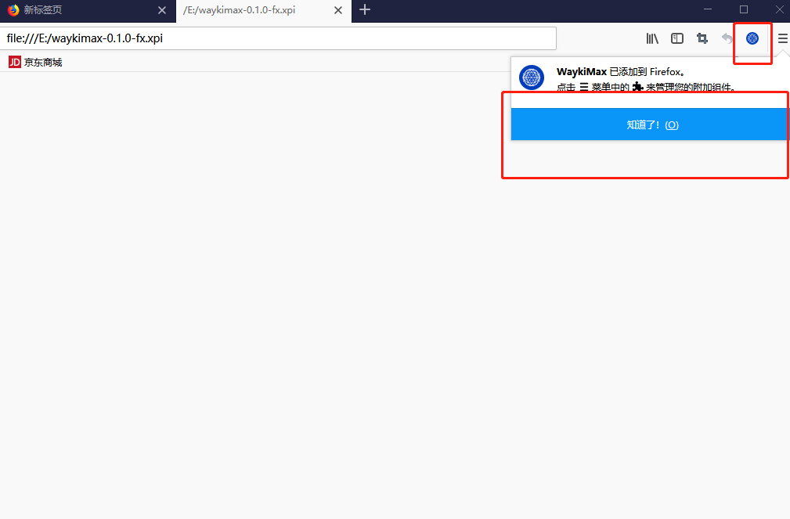

##### Firefox（火狐）浏览器：方法三
**注意：此方法只能临时添加该插件，若关掉此浏览器，则需要重新安装插件**

##### 下载 WaykiMax zip文件到本地并在本地解压缩
[下载 WaykiMax.zip](https://github.com/WaykiChain/wicc-webwallet-extensions/releases/download/v1.0.4/WaykiMax-v1.0.4.zip)

##### 在搜索框，输入："about:debugging#addons"后，点击”临时加载附加组件“
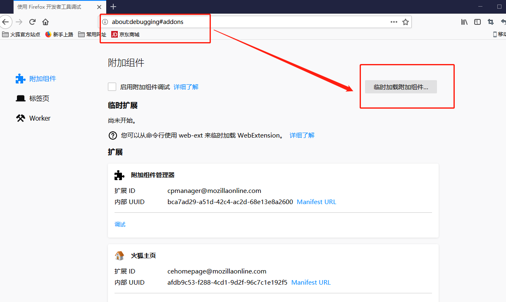
##### 点击刚下载的文件,选择"manifest-firefox.json"，点击”打开“即可
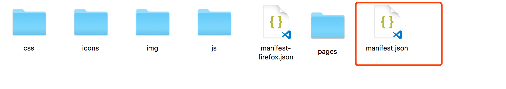
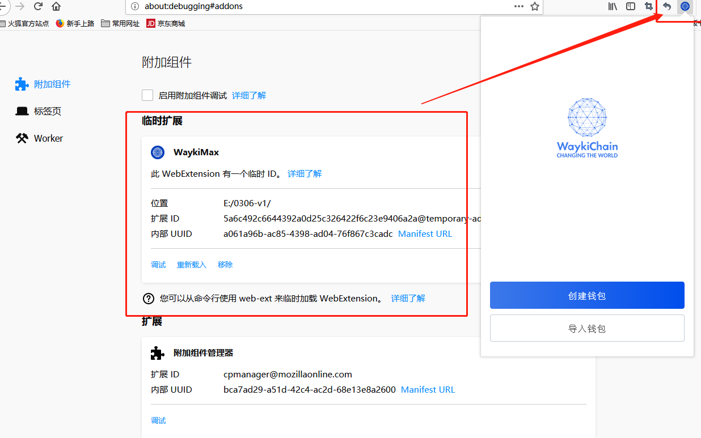

### 360安全浏览器
#### 打开360应用商店链接
https://ext.se.360.cn/webstore/detail/gkbnjblomadjdjbpabffiofapdpigpbd

#### 安装插件到浏览器
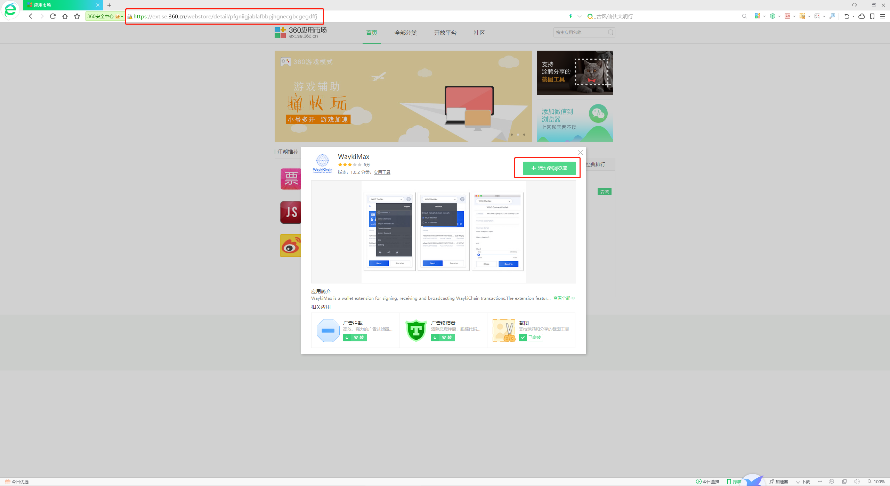
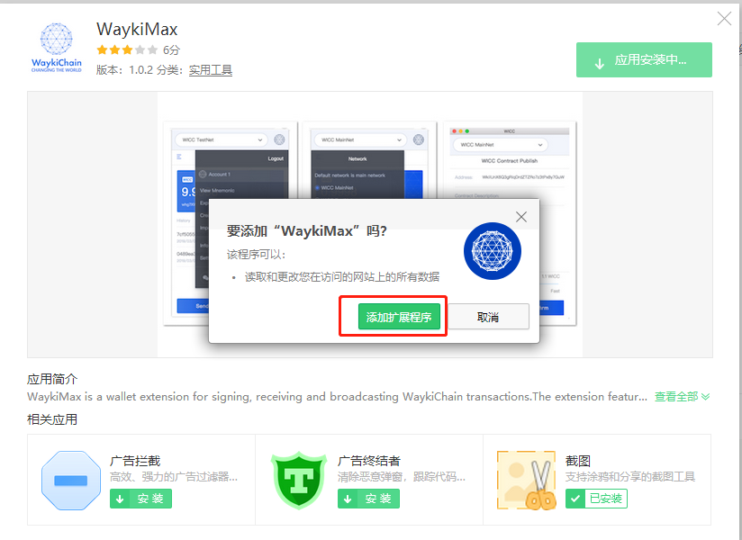
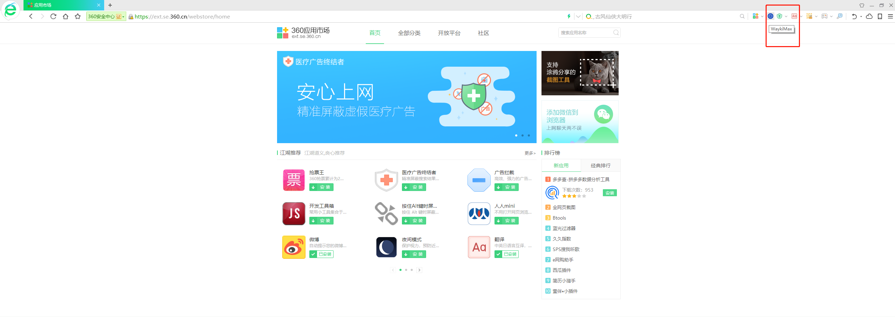

# WaykiBridge

[WaykiBridge](./application_api.md)是维基链开发团队推出的DAPP开发钱包接口工具， 开发者可以在开发DAPP时集成`WaykiBridge`，即只需一套前端代码(H5)即可同时调用 `WaykiMax` 钱包和[维基时代APP](https://www.waykichain.com/WaykiTimes.html)钱包进行签名和广播WaykiChain交易，从而用户可以在`浏览器`和 [维基时代APP](https://www.waykichain.com/WaykiTimes.html)应用中心中同时使用DAPP。
