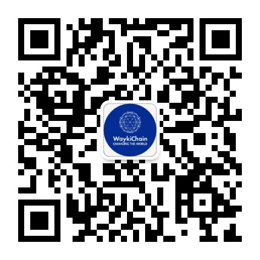

### 维基链开发者培训计划， T2D2（Train the Trainers, Develop the Developers）
train the trainers (培训培训者)， 先集中资源招募并培养一批培训者， 在由培训者开发开发者，培训者在分享知识的同时又能让自己的知识技能得到提升。 

--- 

#### trainer 招募对象：
1. 开发者志愿者
2. 实习生
3. 校园大使
4. 维基链内部开发者

#### trainer任务：
1. 认真接受基于维基链的区块链统一培训
2. 在简答指导下和相互交流的能够学会解决区块链学习中遇到的问题
3. 回答责任范围的维基链开发者社区提问
4. 向所负责的维基链开发者学员执行维基链的统一区块链培训
5. 指导并检查正式学员培训作业的完成

#### trainer 利益：
1. 长期基于维基链的区块链技术培训。
2. Dapp开发指导。
3. 通过培养developer的过程中掌握更深的区块链技能。
4. 区块链开发人员人脉
5. 工资收入。

#### trainer 要求：
1. 对区块链学习有热情
2. 熟悉Linux常用命令
3. 了解网络通信，计算机原理等计算机专业知识
4. 至少熟悉一门开发语言
5. 有回答开发者社区中问题的时间

#### trainer 和 developer培训形式：
1. 维基链开发者社区网站提供培训文档和培训视频
2. 学习者按照维基链设计的学习路线进行学习
3. 论坛问答，微信群问答
4. 直播方式培训，并解答问题
5. 线下培训，并解答问题（待定）
6. 维基链官方安排作业，辅导并检查作业完成。
7. 学员根据自己兴趣提交实践课题，维基链官方安排人员辅导并检查学员完成Dapp。

#### Trainer 成长升级路线
维基链技术爱好者 -> 维基链学员 -> 维基链实习培训师 -> 维基链培训师 -> 维基链资深培训师

--- 

#### Developer 成长升级路线
维基链技术爱好者 -> 维基链学员 -> 维基链开发者 -> 维基链资深开发者 -> 维基链开发者导师

#### 维基链技术爱好者

##### 收益： 
* 维基链技术知识分享
* 维基链培训师技术解答

##### 义务： 
* 不得对社群里其它成员进行言语攻击

##### 奖惩措施
对知识学习热情高的提升为学员有培训师指导， 违反规则者提出社群。

#### 维基链学员

##### 收益： 
* 维基链技术知识分享
* 维基链培训师指导
* 维基链培训师至少半天内回答学员问题

##### 义务： 
* 不得对社群里其它成员进行言语攻击
* 按时学习课程内容并提交作业

##### 奖惩措施
对按时完成任务的学员用心指导， 指定时间内不完成作业的学员退回维基链技术爱好者。

### 报名方式
* 开发者社区技术客服微信
  

微信号:  wjlT2D2

微信名:  维基链开发者社区－YaYa

