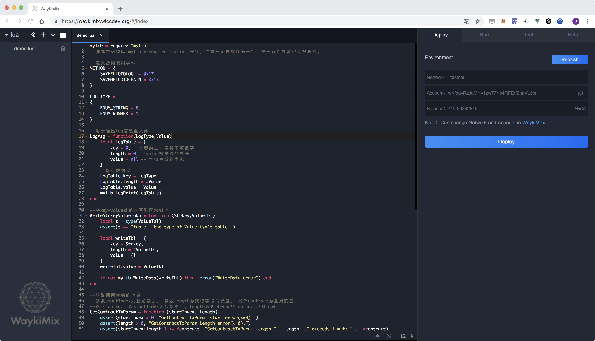
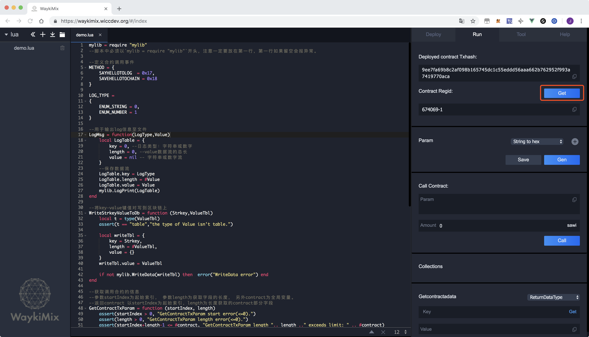
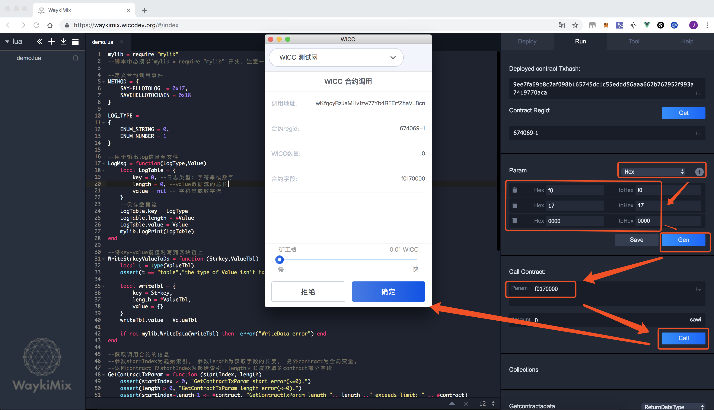
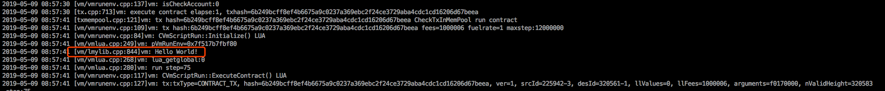
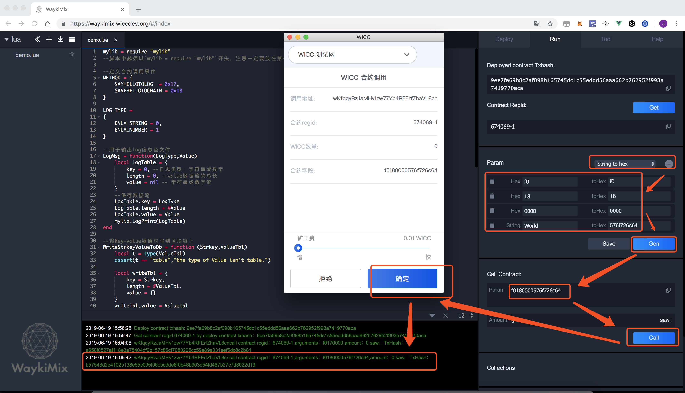
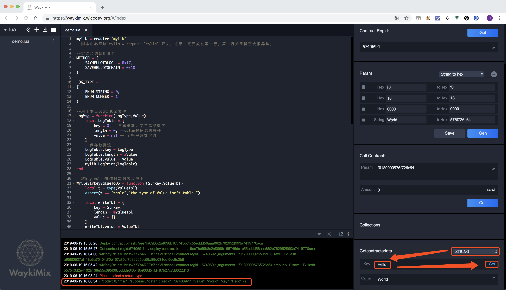

# Hello World
智能合约快速入门指南

## WaykiChain DAPP基础
区块链可以抽象为一个全网同步的状态机，智能合约是在区块链系统上执行的代码，通过交易改变状态机中的状态。由于区块链的特性可以保证智能合约的调用是串行的，全局一致的。

WaykiChain智能合约目前支持`Lua`语言开发，暂不支持多合约互相调用。[学习Lua语言](https://www.runoob.com/lua/lua-basic-syntax.html)

### 关键词

| 关键词 | 说明 |
| :-- | :-- |
| contract | 智能合约内部默认的全局变量名，用于在智能合约内部获取外部调用参数，类型为 table |
| [mylib](./contract_api.md) | 智能合约内部API接口 |
| [常用方法](./common_func.md) | 智能合约开发常用方法,基于 Lua 语言 |
| [mylib使用实例](./api_debug.md) | 基于`mylib`封装的常用使用实例 |
| [WaykiMix](../DeveloperHelper/waykimix.md) | 智能合约开发在线 IDE |
| [WaykiBridge](../DeveloperHelper/application_api.md) | DAPP 钱包接口统一工具 |
| [BaaS](../DeveloperHelper/baas.md) | WaykiChain 区块链公共API|

## Debug环境配置
WaykiChain 智能合约的开发和部署环境支持[WaykiMix](../DeveloperHelper/waykimix.md)在线部署和调用， 搭建[本地测试网节点](../NodeDeployment/testnet.md)可以更方便debug.

## 智能合约基本结构
**`demo.lua`**
```lua
mylib = require "mylib"

Main = function()

end

Main()
```

---
## Helloworld 智能合约源码
该智能合约的入口为`Main`函数，`Main`函数包含两个不同功能方法。

`SayHelloToLog()`用于在log中输出`Hello World!`

`SaveHelloToChain()`用于将`Hello`-`World `以 `key-value` 的形式写到区块链的`LevelDB`中，从而可以在 [BaaS](../DeveloperHelper/baas.md)中查询相应的值。

```lua
mylib = require "mylib"
--脚本中必须以`mylib = require "mylib"`开头，注意一定要放在第一行，第一行如果留空会报异常。

--定义合约调用事件
METHOD = {
    SAYHELLOTOLOG  = 0x17,
    SAVEHELLOTOCHAIN = 0x18
}

LOG_TYPE =
{
    ENUM_STRING = 0,
    ENUM_NUMBER = 1
}

--用于输出log信息至文件
LogMsg = function(LogType,Value)
    local LogTable = {
        key = 0, --日志类型：字符串或数字
        length = 0, --value数据流的总长
        value = nil -- 字符串或数字流
    }
    --保存数据流
    LogTable.key = LogType
    LogTable.length = #Value
    LogTable.value = Value
    mylib.LogPrint(LogTable)
end

--将key-value键值对写到区块链上
WriteStrkeyValueToDb = function (Strkey,ValueTbl)
    local t = type(ValueTbl)
    assert(t == "table","the type of Value isn't table.")

    local writeTbl = {
        key = Strkey,
        length = #ValueTbl,
        value = {}
    }
    writeTbl.value = ValueTbl

    if not mylib.WriteData(writeTbl) then  error("WriteData error") end
end

--获取调用合约的信息
--参数startIndex为起始索引， 参数length为获取字段的长度， 另外contract为全局变量。
--返回contract 以startIndex为起始索引，length为长度获取的contract部分字段
GetContractTxParam = function (startIndex, length)
    assert(startIndex > 0, "GetContractTxParam start error(<=0).")
    assert(length > 0, "GetContractTxParam length error(<=0).")
    assert(startIndex+length-1 <= #contract, "GetContractTxParam length ".. length .." exceeds limit: " .. #contract)

    local newTbl = {}
    local i = 1
    for i = 1,length do
        newTbl[i] = contract[startIndex+i-1]
    end
    return newTbl
end

---------------------------------------------------

SayHelloToLog = function()
    LogMsg(LOG_TYPE.ENUM_STRING,"Hello World!")
end

SaveHelloToChain = function(contextTbl)
    WriteStrkeyValueToDb("Hello",contextTbl)
    LogMsg(LOG_TYPE.ENUM_STRING,"Save Hello To Chain Successfully!")
end

--智能合约入口
Main = function()
  assert(#contract >=4, "Param length error (<4): " ..#contract )
  assert(contract[1] == 0xf0, "Param MagicNo error (~=0xf0): " .. contract[1])

  if contract[2] == METHOD.SAYHELLOTOLOG then
    SayHelloToLog()
  elseif contract[2] == METHOD.SAVEHELLOTOCHAIN then
    local contextTbl = GetContractTxParam(5,5)--获取调用合约的信息==“World”
    SaveHelloToChain(contextTbl)
  else
    error('method# '..string.format("%02x", contract[2])..' not found')
  end
end

Main()

```
---


### 部署智能合约
#### 通过[WaykiMix](../DeveloperHelper/waykimix.md)部署到测试网

#### 通过本地节点RPC [registercontracttx](../JsonRpcApi/contract.md#registercontracttx)部署到测试网

```json
// Request
curl -u Waykichain:admin -d '{"jsonrpc":"2.0","id":"curltext","method":"registercontracttx","params":["wLWxCRWDTb3fUTa6ztoTTCzFwDqzbckSJ7","/tmp/lua/helloworld.lua",110000000]}' -H 'content-type:application/json;' http://127.0.0.1:6967

// Response
{
    "result":
    {
        "hash":"dfdb78278c486016a8588c6ac525eced4348725f5a85af51c898fed320e72e23"
    },
    "error":null,
    "id":"curltext"
}
```

### 查询智能合约regid
#### 通过[WaykiMix](../DeveloperHelper/waykimix.md)查询智能合约regid

#### 通过本地节点RPC [getcontractregid](../JsonRpcApi/contract.md#getcontractregid)查询智能合约regid

```json
// Request
curl -u Waykichain:admin -d '{"jsonrpc":"2.0","id":"curltext","method":"getcontractregid","params":["dfdb78278c486016a8588c6ac525eced4348725f5a85af51c898fed320e72e23"]}' -H 'content-type:application/json;' http://127.0.0.1:6967

// Response
{
    "result":
    {
        "regid:":"320561-1",
        "regid_hex" : "31e404000100"
    },
    "error":null,
    "id":"curltext"
}
```

###  调用智能合约 1
此处调用合约传入参数`f0170000`，根据合约源码可知调用`SayHelloToLog()`方法，即在log中打印`Hello World!`

**[智能合约调用时参数说明](./develop_guide.md/#智能合约调用时参数说明)**

**调用合约的参数解析**
```
               +--------+--------------+-------+
               |  魔法数 + 指定的合约方法 | 保留位 |
"f0170000" =   +--------+--------------+-------+
               |  0xf0  |  0x17        | 0000  |
               +--------+--------------+-------+
```
#### 通过[WaykiMix](../DeveloperHelper/waykimix.md)调用智能合约

#### 通过本地节点RPC [callcontracttx](../JsonRpcApi/contract.md#callcontracttx)调用智能合约

```json
// Request
curl -u Waykichain:admin -d '{"jsonrpc":"2.0","id":"curltext","method":"callcontracttx","params":["wLWxCRWDTb3fUTa6ztoTTCzFwDqzbckSJ7","320561-1",0,"f0170000",1000000]}' -H 'content-type:application/json;' http://127.0.0.1:6967

// Response
{
    "result":
    {
       "hash":"f867200b3d91fd2cbf8b0d8b8840e64bf620f08923acc3126fb960dd04b3064f"
    },
    "error":null,
    "id":"curltext"
}
```
#### 查看日志
前提是在本地节点 `WaykiChain.conf`中添加`debug=vm`，即可查看对应目录下的`vm.log`信息
由截图可知log信息为合约中Check方法的运行内容，即输出`Hello World!`信息至`vm.log`文件


###  调用智能合约 2
此处调用合约传入参数`f0180000576f726c64`，根据合约源码可知调用`SAVEHELLOTOCHAIN()`方法，
即将调用合约的参数截取出后5个字节作为`value`值，"Hello"作为`key`值写到区块链的`LevelDB`中。

**[智能合约调用时参数说明](./develop_guide.md/#智能合约调用时参数说明)**

**调用合约的参数解析**
```
                         +--------+--------------+-------+------------+
                         |  魔法数 + 指定的合约方法 | 保留位 | "World"    |
"f0180000576f726c64" =   +--------+--------------+-------+------------+
                         |  0xf0  |  0x18        | 0000  | 576f726c64 |
                         +--------+--------------+-------+------------+
```

#### 通过[WaykiMix](../DeveloperHelper/waykimix.md)调用智能合约

#### 通过本地节点RPC [callcontracttx](../JsonRpcApi/contract.md#callcontracttx)调用智能合约
```json
// Request
curl -u Waykichain:admin -d '{"jsonrpc":"2.0","id":"curltext","method":"callcontracttx","params":["wLWxCRWDTb3fUTa6ztoTTCzFwDqzbckSJ7","320561-1",0,"f0180000576f726c64",1000000]}' -H 'content-type:application/json;' http://127.0.0.1:6967

// Response
{
    "result":
    {
       "hash":"f65fc179dd9056b06a4a843ee696afa115678bdad523440ae6facd98e7d61a9d"
    },
    "error":null,
    "id":"curltext"
}
```
#### 通过[WaykiMix](../DeveloperHelper/waykimix.md)查询 key-value 值

