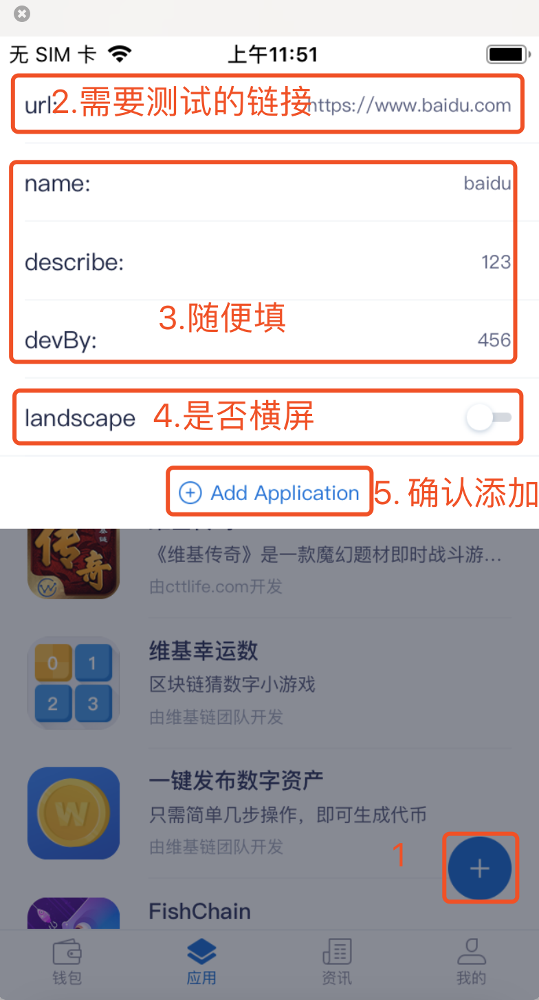

<extoc></extoc>
# WaykiBridge

## 简介
`WaykiBridge`是维基链开发团队推出的DAPP开发钱包接口工具， 开发者可以在开发DAPP时集成`WaykiBridge`，即只需一套前端代码(H5)即可同时调用 `WaykiMax` 钱包和[维基时代APP](https://www.waykichain.com/WaykiTimes.html)钱包进行签名和广播WaykiChain交易，从而用户可以在`浏览器`和 [维基时代APP](https://www.waykichain.com/WaykiTimes.html)应用中心中同时使用DAPP。


## 工具下载

### [Web钱包插件 WaykiMax 下载](./webextension.md)

### 维基时代APP 开发者版本(Testnet)下载
请使用手机浏览器通过以下链接进行下载

**IOS：** https://www.pgyer.com/mHDN 

**安卓：** https://wicc-dev-mix.oss-cn-shenzhen.aliyuncs.com/android/2test/waykitime/WaykiTimes_2.0.0_production_release.apk

### 维基时代APP 正式版本(Mainnet)下载
请使用手机浏览器扫描以下二维码进行下载


### 开发者如何使用维基时代APP添加测试链接

#### 1、【打开维基时代】-> 【我的】->【设置】->【打开开发者模式】
#### 2、【打开维基时代】-> 【应用】->【如下图操作】


## WaykiBridge 调用示例 

**示例链接：** https://waykibridge-testpage.wiccdev.org/

**源码：** https://gitlab.com/waykichain-public/wicc-dapps/wicc-appcenter-test/tree/master

## WaykiBridge API说明

### 准备工作
#### 引入如下js
```
<script src="https://sw91.net/devops/js/waykiBridge.js"></script>
```

**Note:** 引入文件后若是需要在页面加载时即调用接口请做延时处理:

```(setTimeout(() => this.getAddressInfo(), 100);)```

---
### 调用格式

#### waykiBridge.walletPlugin(接口名，接口参数，成功回调，失败回调)


```javascript
waykiBridge.walletPlugin(name,query,function(res){},function(err){})
```
**注1:** query内属性均为string, 数组除外

**注2:** 入参金额单位为 `sawi`

---

### API错误码说明

| errorCode (Int)             | errorMsg (String)                    | 含义                     |
| :------- | :------- | :------- |
| 0 | \ |操作成功|
| 1000 | Please install WaykiMax first. |没有安装钱包|
| 2000 | Please create or import wallet first. |没有创建或者导入钱包|
| 7000 | User denied transaction signature. |用户拒绝签名请求|

**注：** 开发者只需根据 ``errorCode``进行状态判断，`errorMsg` 只用于状态信息提示。

---

### getAddressInfo（获取用户信息）
query参数
```
{} //无参数请传空对象
```
example
```
    waykiBridge.walletPlugin(
        "getAddressInfo",
        {},
        function(res) {
            console.log(res)
        },
        function(err) {
            console.log(err)
        }
    );
```
成功回调
```
{ 
    "result": { 
        "account": { 
            "address": "WPqY8RJHN1u4Kzrnj2mHG9V8igJJVVcveb", 
            "id": "bd2356fa-6137-448e-806f-d6ab09785749", "testnetAddress": "wLnwB9n9PCdP2sWAF3R3KvMujxGnVsE6aa" 
            }, 
        "network": "testnet", 
        "address": "wLnwB9n9PCdP2sWAF3R3KvMujxGnVsE6aa" 
    }, 
    "errorCode": 0 
}
```

**注**：只需读取`result.network` 为当前网络，`result.address` 为当前地址。

---

### walletPluginContractInvoke（合约调用）

query参数：

```
{
    "regId":"",     // 合约regid
    "contractField", "", // 合约字段
    "inputAmount":"",   // 输入金额（没有传0）
    "remark" :""  // 备注，如：猜数字
}
```
example:
```
    waykiBridge.walletPlugin(
        "walletPluginContractInvoke",
        {
          regId: "13103-1",
          contractField: "f0",
          inputAmount: "1",
          remark : ""

        },
        function(res) {
            console.log(res)
        },
        function(err) {
            console.log(err)
        }
    );
```
成功回调
```
{ 
    "result": { 
        "amount": 100000000,
        "fee": 1000000, 
        "contract": "f0",
        "txid":"029c86a648030e2b28ccc64c5ed60c96a0c61de95a30cab82159a476ceeeaf3d", 
        "regId": "91647-1", 
        "txType": null,
        "toAddress": "wNTJYM3gyXJH9dPQe96ofyHotf5eq3EP14", 
        "sendAddress": "wLnwB9n9PCdP2sWAF3R3KvMujxGnVsE6aa" 
      }, 
    "errorCode": 0 
}
```

### walletPluginContractIssue（合约发布）
query参数
```
{
    "contractContent": "", //合约内容
    "contractDesc": ""     //合约描述
}
```
example
```
    waykiBridge.walletPlugin(
        "walletPluginContractInvoke",
        {
          contractContent: 'mylib = require "mylib"',
          contractDesc: "描述",
        },
        function(res) {
            console.log(res)
        },
        function(err) {
            console.log(err)
        }
    );
```
成功回调
```
{
    "result": { 
         "amount": 0, 
         "fee": 110000000, 
         "contract": null, 
         "txid": "4bbbee4320843d19d4a008bfc7dc1a26fdf5ed9c1a96415db033d4f83c6e9fa0", 
         "regId": "91647-1", 
         "txType": null,
         "toAddress": null,
         "sendAddress": "wLnwB9n9PCdP2sWAF3R3KvMujxGnVsE6aa"
    }, 
    "errorCode": 0 
}
```


### walletPluginTransfer（转账）
query参数
```
{
    "amount",""   //转账金额
    "collectionAddress", "" //转账目标钱包的地址
    "remark": "" //备注
}
```
example:
```
    waykiBridge.walletPlugin(
        "walletPluginTransfer",
        {
          amount: "100000000", 
          collectionAddress: "Wi2H3XAhMtdLPkjQVSkYXhF3GRNTwAhtqA",
          remark: "备注"
        },
        function(res) {
          _this.transferRes = res;
        },
        function(err) {
          _this.transferRes = err;
        }
    );
```
成功回调
```
{ 
    "result": { 
        "amount": 10000000, 
        "fee": 10000, 
        "contract": "", 
        "txid": "64244292b9abb2e5b8d55a3f37584781e0151e0358a440b0e910100f9970957b",
        "regId": "91647-1", 
        "txType": null, 
        "toAddress": "weyg6FeZP5Mf6dNn1TQJbU7pHhLx1QMkZ8", 
        "sendAddress": "wLnwB9n9PCdP2sWAF3R3KvMujxGnVsE6aa" 
    }, 
    "errorCode": 0 
}
```


