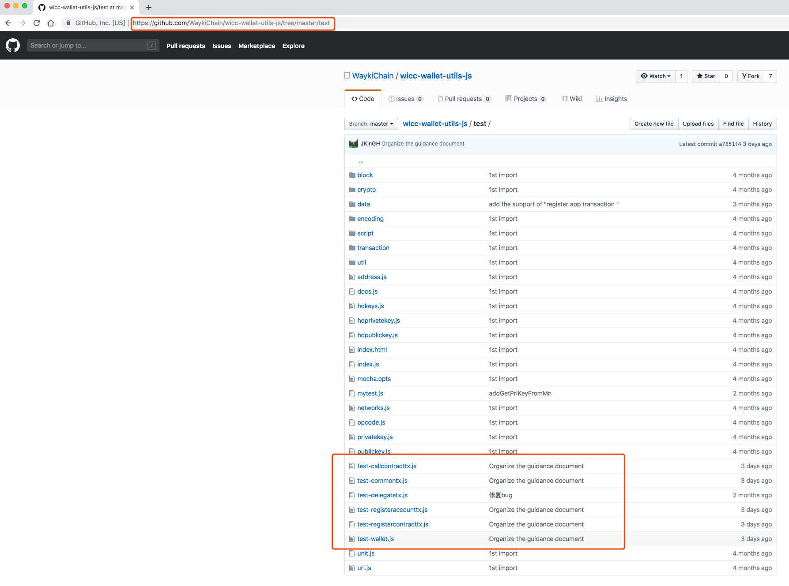

# JavaScript 离线签名库开发指南

## 简介
当开发者需要使用JavaScript进行 `生成助记词`、`助记词转私钥`、`创建地址`、`注册地址`、`转账`、`部署合约`、`调用合约`、`投票`等操作时，维基链提供JavaScript的离线签名库供其使用。

## 源码和库
https://github.com/WaykiChain/wicc-wallet-utils-js

## 使用方法
**详见项目简介和以下截图中test JavaScript demo代码与注释**

