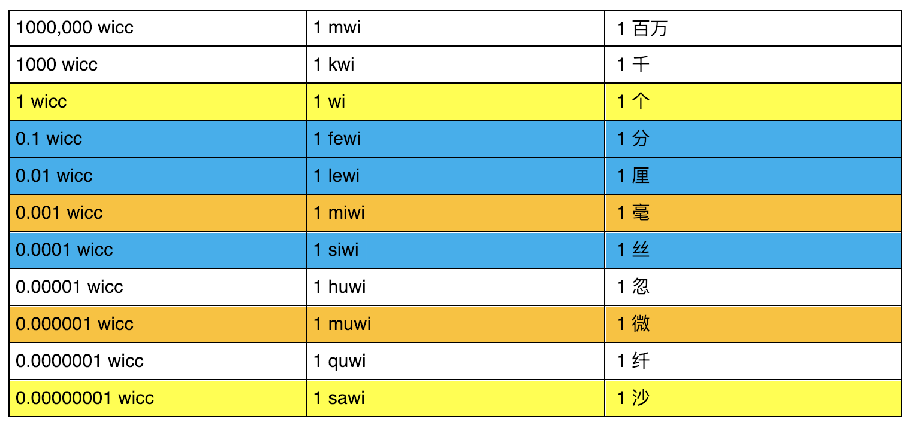

# 常见问题

## WICC最小单位`sawi`


## 账户说明
维基链采用类似`ETH`的账户模型，不是`UTXO`,只有普通账户和合约账户，每个账户可以用base58地址`WKfqqyRzJaMHv1zw77Yb4RFErfZhaVL8cn`或者regid `1234-1` 表示。

新建账号不需要花费、抵押WICC，每个账号在注册之前可以收到维基币，注册成功之后才可以主动转出维基币。

注册账号时自己注册即可，前提是账号中有足够的余额，因为注册实际是一笔交易，最少需要花费 10000`sawi`=0.0001 WICC,注册成功后会生成对应的`regid`

## 共识机制

`DPOS`,目前11个超级节点


## 配置文件路径错误

* 如下错误是提示配置文件路径错误
```
 error: You must set rpcpassword=<password> in the configuration file:
/root/.WaykiChain/WaykiChain.conf
If the file does not exist, create it with owner-readable-only file permissions.
```
* 如果是运行 ./coind -datadir=.  则配置文件WaykiChain.conf应该在coind所在同级目录下
* 如果是运行 ./coind 后面不带-datadir=. 则配置文件WaykiChain.conf应该在当前用户目录的.WaykiChain文件夹下

## 节点启动失败
* 出现如下错误

```
root@ubuntu:/home/jk/workspace/wicc/WaykiChain_deply1# ./coind -datadir=.


************************
EXCEPTION: N5boost16exception_detail10clone_implINS0_19error_info_injectorINS_6system12system_errorEEEEE
bind: Address already in use
Coin in AppInit()

Shutdown : done
root@ubuntu:/home/jk/workspace/wicc/WaykiChain_deply1#
```

* 解决方法：先kill掉正在运行的节点进程，再重新启动

```
root@ubuntu:/home/jk/workspace/wicc/WaykiChain_deply1# ps -ef|grep coind
root      20588   1794  6 Dec25 ?        08:46:04 ./coind
root      29810  29768 93 11:51 pts/0    04:55:05 ./coind -datadir=.
root      30489  30322  0 17:05 pts/25   00:00:00 grep --color=auto coind
root@ubuntu:/home/jk/workspace/wicc/WaykiChain_deply1# kill 29810
root@ubuntu:/home/jk/workspace/wicc/WaykiChain_deply1# ./coind -datadir=.
WaykiChain version v1.1.0.1-075db0b-dirty-release-linux (2018-12-26 15:47:51 +0800)
Using OpenSSL version OpenSSL 1.0.1f 6 Jan 2014
Using Lua version Lua 5.3.1
Using Boost version 1.54
Using Level DB version 1.17
Using Berkeley DB version Berkeley DB 4.8.30: (April  9, 2010)
Startup time: 2018-12-31 09:06:01
Default data directory /root/.WaykiChain
Using data directory /home/jk/workspace/wicc/WaykiChain_deply1/./testnet
Using at most 125 connections (		1024 file descriptors available)
```
## 节点同步中止
**解决方法**
1. 重启
2. 如果经常出现区块同步长时间中止时，可通过`crontab`命令添加定时执行脚本进行重启的任务

不了解`crontab`使用的可以先参考[crontab教程](https://blog.csdn.net/u010159567/article/details/86258441)

#### 本地部署

* `/root/wayki/checkblock.sh`脚本内容如下:

```
#!/bin/bash

echo "start check to blockcount:"

date

blockfile="wicc.blocks"
touch $blockfile
past_blockcount=`tail -n 1 $blockfile`
echo  "past blockcount:$past_blockcount"

current_blockcount=`docker exec -it waykicoind-main /opt/wicc/coind  getblockcount`
echo "current blockcount:$current_blockcount"

if [ $current_blockcount = $past_blockcount ]
then
  echo "current blockcount equal to past blockcount, so restart the waykicoind."
  docker restart waykicoind-main
else
  echo "current blockcount does not equal to past blockcount, so go ahead."
  past_blockcount=$current_blockcount
fi

echo $current_blockcount>$blockfile
echo "Now the past blockcount is $past_blockcount "

echo "end！"

```

* 使用 `crontab -e` 添加定时任务

**example**

1小时做一次检测
```
0 */1 * * *   /root/wayki/checkblock.sh >> /root/wayki/checkblock.log

```


#### Docker本地部署

* `/root/wayki/auto_restart.sh`脚本内容如下:

```shell
#!/bin/bash

echo "native start check to blockcount:"
date

echo $1
cd $1

blockfile="wicc.blocks"
touch $blockfile
past_blockcount=`tail -n 1 $blockfile`
echo  "past blockcount:$past_blockcount"

current_blockcount=`./coind -datadir=. getblockcount`
echo "current blockcount:$current_blockcount"

if [ $current_blockcount = $past_blockcount ]
then
  echo "current blockcount equal to past blockcount, so restart the waykicoind."
  ./coind -datadir=. stop
  sleep 3
  ./coind -datadir=.
else
  echo "current blockcount does not equal to past blockcount, so go ahead."
  past_blockcount=$current_blockcount
fi

echo $current_blockcount>$blockfile
echo "Now the past blockcount is $past_blockcount "

echo "end！"

```

* 使用 `crontab -e` 添加定时任务

**example**

1小时做一次检测
```
0 */1 * * *   /root/wayki/auto_restart.sh >> /root/wayki/auto_restart.log

```
**Note: shell脚本后面接的参数`current_blockcount`为coind所在文件夹路径**

## 区块同步时间久问题
**手动使用下载已经同步好的区块**
从0开始下载区块估计要10多个小时，如果希望快速同步区块，可以通过如下链接下载同步好的数据，将文件夹blocks的数据拷贝到main(主网)文件夹下，然后重新启动

* mainnet:
http://waykichain.oss-cn-shenzhen.aliyuncs.com/mainnet/wicc-main-blocks-190408.tar.gz


## WTIMES 
* wtimes是维基时代重要的流通通证，未来可兑换维基链周边礼品以及社区相关福利，请持续关注维基时代。
* wtimes 按一分钱一个的价值来运营，只能兑换礼品，不支持提现

# WiccWallet
钱包插件`WaykiMax`为开发者提供了`WiccWallet`接口。开发者可以在开发DAPP时集成`WiccWallet`接口，方便开发者签名和广播WaykiChain交易。从而用户可以在浏览器中使用DAPP。

**注1：WaykiMax 会为每个网站的站点注入一个全局变量：`WiccWallet`**

**注2：如果开发者需要在移动端和Web端使用同一套代码(H5)调用钱包，请使用[WaykiBridge](../DeveloperHelper/application_api.md)**

## getDefaultAccount
取得当前默认的账户，使用方法如下：

```
WiccWallet.getDefaultAccount().then((account) => {
 console.log(account) 
}, (error) => {
  console.log(error)
})
```

如果钱包已经解锁，并且创建过账户，则会返回类似下面的结果：

```
{
  "account": {
    "address": "WTTqpSPZ9JHQJAPsmJQb1kXcMz5HvRWJLv",
    "id": "eddd9578-8264-4f62-b215-da22a455152b",
    "testnetAddress": "wQREsAsRAV1j133FHK4M5XQPPG3n4W23P1"
  },
  "network": "testnet",
  "address": "wQREsAsRAV1j133FHK4M5XQPPG3n4W23P1"
}
```

network 为当前网络，address 为当前地址。如果需要获取正式环境的地址，使用 account.address；如果需要获取测试环境地址，使用 account.testnetAddress 。

## callContract
打开调用合约窗口，目前支持四个参数：`regId`  `contract` `value` `callback`。

方法定义为`WiccWallet.callContract(regId, contract, value, callback)`，使用方式为：
```
WiccWallet.callContract('13103-1', 'f0', 0, (error, data) => console.log(error, data)).then(() => {
}, (error) => {
  console.log(error)
})
```

对于 callback 参数，是用户在点击「确定」按钮之后的一个回调，第一个参数为 error，第二个参数为 data。如果 error 为 null，则可认为调用成功。 data 的数据结构类似下面这样（其中 txid 为这次交易的 hash）：

```
{
  amount: 0,
  fee: 1000000,
  contract: "f0",
  txid: "55ec1c7abe38c492894a09f0c99e16d7c8d68608a2f1f6d334d0fd101b503e5b",
  regId: "9109-1", 
   …
}
```

对于 value 参数，需要原始值乘以10的8次方。比如需要使用 0.1 WICC，则`value`需要写 1000000。

## publishContract
打开发布合约窗口，目前支持三个参数：`script`  `scriptDesc` `callback`。

```
WiccWallet.publishContract('mylib = require "mylib"', '33333', (error, data) => console.log(error, data)).then(() => {
}, (error) => {
  console.log(error)
})
```

关于 callback，请参照 callContract 。

## requestPay
打开调用转账窗口，目前支持四个参数：`destAddress` `value`  `desc`  `callback`。

```
WiccWallet.requestPay('wYXV7QzHZnb8LuWw7Xa24dfUTqmH2tNZBq', 0.01 * Math.pow(10, 8), 'desc', (error, data) => console.log(error, data)).then(() => {
}, (error) => {
  console.log(error)
})
```

对于 value 参数，需要原始值乘以10的8次方。比如需要使用 0.1 WICC，则`value`需要写 1000000。


关于 callback，请参照 callContract 。


## requestVote
打开节点投票窗口，目前仅支持一个参数 `votes`，每个 votes 下面有两个属性 `address` 和 `votes`，示例如下：

```
WiccWallet. requestVote([{
  address: 'wNQ8bTNN9eRj4U5hawdRJhvoGpMAfHfrZP',
  votes: 2000001
}, {
  address: 'wfhKnmXbE3n49trwd9CsvnzGqScJLLf4Jb',
  votes: 2000002
}], (error, data) => console.log(error, data)).then(() => {
}, (error) => {
  console.log(error)
})
```

对于 votes 参数，需要原始值乘以10的8次方。比如需要使用 0.1 WICC，则`value`需要写 1000000。


关于 callback，请参照 callContract 。


## genCallContractRaw
打开调用合约窗口，目前支持四个参数：`regId`  `contract` `value` `callback`。

方法定义为`WiccWallet.genCallContractRaw(regId, contract, value, callback)`，使用方式为：
```
WiccWallet.genCallContractRaw('13103-1', 'f0', 0, (error, data) => console.log(error, data)).then(() => {
}, (error) => {
  console.log(error)
})
```

对于 callback 参数，是用户在点击「确定」按钮之后的一个回调，第一个参数为 error，第二个参数为 data。如果 error 为 null，则可认为调用成功。 data 的数据结构类似下面这样（其中 txid 为这次交易的 hash）：

```
{
  rawtx: "0401809ad912058086b1100103e52f01bc834a0001f0473045…faf6143b3b60ea6ab4e9afb312d9a81ddcaac55d03ef639fb"
}
```

对于 value 参数，需要原始值乘以10的8次方。比如需要使用 0.1 WICC，则`value`需要写 1000000。

## genPublishContractRaw 
打开发布合约窗口，目前支持三个参数：`script`  `scriptDesc` `callback`。

```
WiccWallet.genPublishContractRaw('mylib = require "mylib"', '33333', (error, data) => console.log(error, data)).then(() => {
}, (error) => {
  console.log(error)
})
```

关于 callback，请参照 genCallContractRaw 。

## genRequestPayRaw
打开调用转账窗口，目前支持四个参数：`destAddress` `value`  `desc`  `callback`。

```
WiccWallet.genRequestPayRaw('wYXV7QzHZnb8LuWw7Xa24dfUTqmH2tNZBq', 0.01 * Math.pow(10, 8), 'desc', (error, data) => console.log(error, data)).then(() => {
}, (error) => {
  console.log(error)
})
```

对于 value 参数，需要原始值乘以10的8次方。比如需要使用 0.1 WICC，则`value`需要写 1000000。


关于 callback，请参照 genCallContractRaw。

## genVoteDelegateRaw
打开节点投票窗口，目前仅支持一个参数 `votes`，每个 votes 下面有两个属性 `address` 和 `votes`，示例如下：

```
WiccWallet.genVoteDelegateRaw([{
  address: 'wNQ8bTNN9eRj4U5hawdRJhvoGpMAfHfrZP',
  votes: 2000001
}, {
  address: 'wfhKnmXbE3n49trwd9CsvnzGqScJLLf4Jb',
  votes: 2000002
}], (error, data) => console.log(error, data)).then(() => {
}, (error) => {
  console.log(error)
})
```

对于 votes 参数，需要原始值乘以10的8次方。比如需要使用 0.1 WICC，则`value`需要写 1000000。


关于 callback，请参照 genCallContractRaw 。
