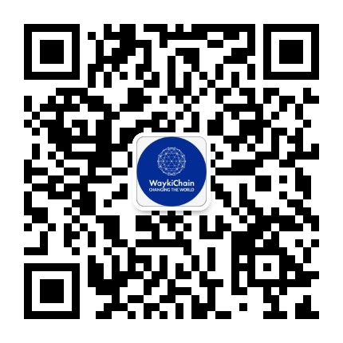

## 维基链开发者文档介绍
* v1.0.0, 持续更新中

### 维基链开发者学习路线(没有计算机技术基础的人请先自行学习计算机技术基础知识)：
#### 1. 开发者必备知识：
  * 熟悉计算机网络通信知识
  * 至少掌握一门计算机开发语言
  * 熟悉Linux操作

#### 2. 基本知识：
  * [区块链基本知识](Knowledge/blockchain.md)
  * [了解维基链](Knowledge/waykichain.md)

#### 3. 维基链节点：
  * [本地部署](NodeDeployment/build.md)或者[Docker部署](NodeDeployment/docker.md)
  * 调用Json Rpc Api(包括命令行调用和curl通信调用)
  * 编写代码调用维基链节点Json Rpc Api

#### 4. 智能合约开发：
  * 了解维基链智能合约基本知识
  * 学习[智能合约 API](Contract/contract_api.md)
  * 部署维基链智能合约
  * 调用维基链智能合约
  * 开发智能合约

#### 5. Dapp开发
  * 了解维基链开发的Dapp
  * 学会调用[安卓库](Mobile/Android.md)或者[IOS库](Mobile/Ios.md)
  * 根据需求设计Dapp
  * 根据需求开发智能合约
  * 开发代码调用智能合约
  * 整体开发完成

### 区块链学习经验分享
* 相比于其他技术知识的学习，区块链知识刚开始学习起来，很难一下子理解，但是多经过一些实践，经过一些讨论，然后一些知识再反复看几遍，才能更好的理解

### 维基链培训课程学习视频 （视频持续更新中）
* https://study.163.com/course/introduction/1006498013.htm

### 作业
* 每个大章节里，我们都会布置作业，完成作业可以获取WTIMES奖励， 而且完成所有作业以后有资格领取维基链委托的开发任务，获取丰厚的WICC奖励

### 联系我们
* 开发者社区技术客服微信

微信号:  wjlT2D2

微信名:  维基链开发者社区－YaYa

* 开发者社区telegram群：
https://t.me/waykichaindevs

* 开发者社区联络邮箱：
jiao.zheng@waykichainhk.com
